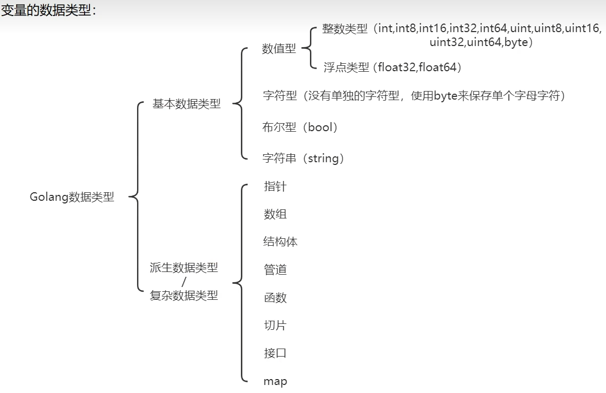
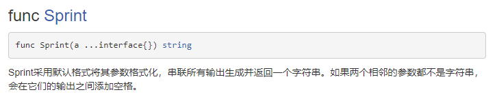

# go语法

### 0. 标准库文档

https://studygolang.com/pkgdoc

### 1. hello world

```go
package main //声明文件所在的包，每个go文件必须有归属的包

import "fmt" // 引入程序中需要使用的包

func main() { // main函数，程序入口
	fmt.Println("hello world!")
}
```

### 2. 变量

```go
package main

import "fmt"

// 全局变量
var (
	c1 = 3
	c2 = 3.14
	c3 = "ccc"
)

func main() {
	// 局部变量
	// 定义单个变量
	var age int = 18
	fmt.Println(age) // 18

	var name = "tsinghhua"
	fmt.Println(name) // tsinghhua

	var key int
	fmt.Println(key) // 0

	score := 99
	fmt.Println(score) // 99

	// 定义多个变量
	var a1, a2, a3 = 1, "abc", 10.9
	fmt.Println(a1, a2, a3) // 1 abc 10.9

	var (
		b1 = 2
		b2 = 3.14
		b3 = "bbb"
	)
	fmt.Println(b1, b2, b3) //2 3.14 bbb

	fmt.Println(c1, c2, c3) // 3 3.14 ccc
}

```

### 3. 数据类型



#### 3.1 整数类型

```go
package main

import (
	"fmt"
	"unsafe"
)

func main() {
	// 有符号整数类型
	var num1 int8                       // -128 ~ 127
	var num2 int16                      // -2^15 ~ 2^15-1
	var num3 int32                      // -2^31 ~ 2^31-1
	var num4 int64                      // -2^63 ~ 2^63-1
	fmt.Println(num1, num2, num3, num4) // 0 0 0 0

	// 无符号整数类型
	var unum1 uint8                         // 0 ~ 2^8-1
	var unum2 uint16                        // 0 ~ 2^16-1
	var unum3 uint32                        // 0 ~ 2^32-1
	var unum4 uint64                        // 0 ~ 2^64-1
	fmt.Println(unum1, unum2, unum3, unum4) // 0 0 0 0

	// 其他整数类型
	var number int               // 根据操作系统位数表示大小 32位 = int32 64位 = int64
	var unumber uint             // 根据操作系统位数表示大小 32位 = uint32 64位 = uint64
	fmt.Println(number, unumber) // 0 0
	var number1 = 1
	fmt.Printf("unmber1类型是: %T", number1) // unmber1类型是: int
	fmt.Println()
	fmt.Println("占用字节数：", unsafe.Sizeof(number1)) // 占用字节数：8
	var age byte = 18                             	 // 等价uint8
	fmt.Println(age)                                 //18
	var a rune = 18                                  // 等价int32
	fmt.Println(a)                                   //18
}

```

#### 3.2 浮点数据类型

```go
package main

import (
	"fmt"
)

func main() {
	// 浮点数类型
	var num1 float32 = 3.14 //-3.403E38 ~ 3.403E38
	var num2 float32 = -314e-2
	var num3 float64 = 31415e-4   //-1.7983E308 ~ 1.798E308
	fmt.Println(num1, num2, num3) // 3.14 -3.14 3.1415
	var num4 = 3.14
	fmt.Printf("默认数据类型:%T", num4) // 默认数据类型:float64
}
```

#### 3.3 字符类型（char）

> 没有专门的字符类型，用byte保存
>
> 字符串是由字节组成

```go
package main

import (
	"fmt"
)

func main() {
	// 直接输出byte类型字符，实际输出ASCII码
	var a byte = 'a'
	var b byte = '0'
	fmt.Println(a)                  //97
	fmt.Println(b)                  //48
	fmt.Printf("a=%c b=%c\n", a, b) // a=a b=0

	var c int = '北'
	fmt.Printf("c=%c 字节码值是%d\n", c, c) //c=北 字节码值是21271

	// 本质字符是整数
	fmt.Println(10 + c)                //21281 = 10+21271
}

```

#### 3.4 bool类型

>  true false 占用一个字节

#### 3.5 字符串类型（string）

由单个字符连接，使用UTF-8编码

```go
package main

import (
	"fmt"
)

func main() {
	var str string = "hello golang \n"
	fmt.Println(str) // hello golang
	// str[0] = 'a' 字符串不可变
	var str2 string = `hello golang \n` // 反引号不识别转义 hello golang \n
	fmt.Println(str2)
    // 字符串换行拼接+放在末尾。自动在代码末尾添加；
	var str3 string = "hello " + "world " + "hello " + "world " +
		"hello " + "world " + "hello " + "world "
	fmt.Println(str3) //hello world hello world hello world hello world
}
```

#### 3.6 数值类型相互转换

>  不同数值类型必须显示转换
>
> 基本语法：```T(v)``` 将值v转换为类型T

```go
package main

import (
	"fmt"
)

func main() {
	var a int = 100
	// var b float32 = a
	var b float32 = float32(a)
	fmt.Println(b)
	//精度大到小会做溢出处理（截取后面二进制数字，超出部分丢失）
}
```

#### 3.7 数值类型与字符串类型的互相转换




> 数值类型转字符串

```go
package main

import (
	"fmt"
)

func main() {
	var a int = 100
	var b float32 = 3.14
	var c bool = true
	var d byte = 'h'
	var str string

	str = fmt.Sprintf("%d", a)
	fmt.Printf("srt type %T str=%q\n", str, str) //srt type string str="100"

	str = fmt.Sprintf("%f", b)
	fmt.Printf("srt type %T str=%q\n", str, str) //srt type string str="3.140000"

	str = fmt.Sprintf("%t", c)
	fmt.Printf("srt type %T str=%q\n", str, str) //srt type string str="true"

	str = fmt.Sprintf("%c", d)
	fmt.Printf("srt type %T str=%q\n", str, str) //srt type string str="h"
}
```

> 字符串转数值类型
>
> string转数值类型，hello转会直接转成0
```go
func ParseBool(str string) (value bool, err error)
// 返回字符串表示的bool值。它接受1、0、t、f、T、F、true、false、True、False、TRUE、FALSE；否则返回错误。

func ParseInt(s string, base int, bitSize int) (i int64, err error)
// 返回字符串表示的整数值，接受正负号。

// base指定进制（2到36），如果base为0，则会从字符串前置判断，"0x"是16进制，"0"是8进制，否则是10进制；

// bitSize指定结果必须能无溢出赋值的整数类型，0、8、16、32、64 分别代表 int、int8、int16、int32、int64；返回的err是*NumErr类型的，如果语法有误，err.Error = ErrSyntax；如果结果超出类型范围err.Error = ErrRange。

func ParseFloat(s string, bitSize int) (f float64, err error)
// 解析一个表示浮点数的字符串并返回其值。
// 如果s合乎语法规则，函数会返回最为接近s表示值的一个浮点数（使用IEEE754规范舍入）。bitSize指定了期望的接收类型，32是float32（返回值可以不改变精确值的赋值给float32），64是float64；返回值err是*NumErr类型的，语法有误的，err.Error=ErrSyntax；结果超出表示范围的，返回值f为±Inf，err.Error= ErrRange。
```

```go
package main

import (
	"fmt"
	"strconv"
)

func main() {
	var str string = "true"
	var b bool
	b, _ = strconv.ParseBool(str) // 返回2个值，用_忽略返回错误
	fmt.Println(b)                // true

	var str2 string = "1234590"
	var n1 int64
	n1, _ = strconv.ParseInt(str2, 10, 64)
	fmt.Println(n1) // 1234590

	var str3 string = "3.1415"
	var n2 float64
	n2, _ = strconv.ParseFloat(str3, 64)
	fmt.Println(n2) // 3.1415

	var str4 string = "hello"
	var n3 int64
	n3, _ = strconv.ParseInt(str4, 10, 64)
	fmt.Println(n3) // 0
}
```

#### 3.8 指针

> & 返回变量存储的地址
>
> \* 取指针变量对应的数值

```go
package main

import (
	"fmt"
)

func main() {
	var age int = 18
	fmt.Println("返回变量存储的地址:", &age) //返回变量存储的地址: 0xc00000a0a8

	var ptr *int = &age
	fmt.Println(ptr)                 //0xc00000a0a8
	fmt.Println("取指针变量对应的数值:", *ptr) //取指针变量对应的数值: 18
}
```

#### 3.9 值类型与引用类型

值类型：基本数据类型（int、float） 、bool、string、数组和结构体struct
> 变量直接存储值，内存通常在**栈**中分配。

引用类型：指针、slice切片、map、管道chan、interface 等

> 变量存储一个地址，地址对应的空间才真正存储数据（值），内存通常在**堆**中分配。
>
> 当没有任何变量引用这个地址，对应数据空间成为垃圾，由GC回收。

### 4. 运算符

#### 4.1 算数运算符

```go
package main

import (
	"fmt"
)

func main() {
	// + - * / %取余 ++自增 --自减
	var a1 int = +10              // 表示正数
	fmt.Println(a1)               //10
	var a2 int = 4 + 7            // 表示相加
	fmt.Println(a2)               //11
	var a3 string = "abc" + "def" // 表示字符串拼接
	fmt.Println(a3)               // abcdef

	// ++ -- 只能在变量后面，只能单独使用，不能参与运算
	var a4 int = 10
	a4++
	fmt.Println(a4) // 11
}
```

#### 4.2 赋值运算符

```go
package main

import (
	"fmt"
)

func main() {
	// 赋值运算符 = += -= *= /= %=
	var a1 int = 10
	fmt.Println(a1) // 10
	var a2 int = 5 * 4
	fmt.Println(a2) //12

	var a3 int = 10
	a3 += 20        // 等价a3 = a3 + 20
	fmt.Println(a3) //30
}
```

#### 4.3 关系运算符

```go
package main

import (
	"fmt"
)

func main() {
	// 关系运算符 == != > < >= <= 返回结果bool类型
	fmt.Println(5 == 9) //false
	fmt.Println(5 != 9) //true
	fmt.Println(5 > 9)  //false
	fmt.Println(5 < 9)  //true
	fmt.Println(5 >= 9) //false
	fmt.Println(5 <= 9) //true
}
```

#### 4.4 逻辑运算符

```go
package main

import (
	"fmt"
)

func main() {
	// 逻辑运算符 &&与 ||或  !非
	fmt.Println(true && false) //false
	fmt.Println(true || false) //true
	fmt.Println(!true)         //false
}
```

#### 4.5 位运算符

略

#### 4.6其他运算符

位运算符：&  |   ^  

其他（指针）：&  *


### 5. 流程控制

- 顺序控制  自上而下执行
- 分支控制  if  switch
- 循环控制  for


#### 5.1 分支控制

1. if基本语法：

```go
// 单分支
if 条件表达式{
	执行代码块
}
// 双分支
if 条件表达式{
	执行代码块
}else{
    执行代码块
}
// 多分支
if 条件表达式{
	执行代码块
}else if 条件表达式{
    执行代码块
}
...
else {
    执行代码块
}
```

2. switch基本语法（没有break）

```go
switch 条件表达式{
    case 表达式1，...：
    	语句块1
    case 表达式2，...：
    	语句块2
    ...
    default:
    	语句块3
}
```

#### 5.2 循环控制

1. for基本语法

```go
for 循环变量初始化；循环条件；循环变量迭代{
    循环操作语句
}

// 代码实现
package main

import (
	"fmt"
)

func main() {
    // 第一种写法
    for i := 1; i <= 10; i++ {
		fmt.Println("hello world")
	}
    // 第二种写法
	i := 1
	for i <= 10 {
		fmt.Println("hello world")
		i++
	}
    // 第三种写法（死循环）配合break跳出循环
    for{
        fmt.Println("hello world")
    }
    // 死循环
    for ;; {
		fmt.Println("hello world")
	}
    
    // for-range 遍历字符串和数组    
    var str string = "hello world 你好，世界"
    str1 := []rune(str)// 针对有中文遍历有乱码，一个汉字3个字节，str1[i]按照字节遍历
	for i := 0; i < len(str1); i++ {
		fmt.Printf("%c\n", str1[i])
	}
	for index, val := range str {
		fmt.Printf("%d,%c\n", index, val)
	}
}
```

2. break控制（跳出最近的for循环）

```go
// 随机生成1-100，直到遇到99，统计用了多少次
package main

import (
	"fmt"
	"math/rand"
)

func main() {
	var count int = 0
	for {
		n := rand.Intn(100) + 1
		if n == 99 {
			fmt.Println("总共遍历次数", count)
			break
		}
		count++
	}
}
```

3. continue结束本次循环，继续执行下次循环
4. goto可以无条件转移到程序指定行，一般不主张用

### 6. 包

每个文件都属于一个包，一个包一个文件夹

1. 区分相同名字的函数、变量等标识符

2. 管理项目

3. 控制函数、变量等作用域

语法

```package 包名```

```import 项目根路径/包路径```

**包名通常与文件夹保持一致**


### 7. 函数

#### 7.1 基本语法

```go
func 函数名（形参列表）（返回值列表）{
    执行语句...
    return 返回值列表
}

```

#### 7.2  init函数

- 无实参和返回值

- 每一个源文件都可以有一个init函数。在main函数调用之前调用init函数。

- 主要作用是完成初始化。

- 执行顺序：全局变量>init函数>main函数

  ```go
  package main
  
  import (
  	"fmt"
  )
  
  func init()  {
  	fmt.Println("hello init")
  }
  func main() {
  	fmt.Println("hello world")
  }
  ```

#### 7.3匿名函数

```go
package main

import (
	"fmt"
)

var (
	fun1 = func(a int, b int) int {
		return a + b
	}
)

func main() {
	// 匿名函数第一种方式：直接调用
	res := func(a int, b int) int {
		return a + b
	}(10, 20)
	fmt.Printf("res=%v\n", res) // res=30
	// 匿名函数第二种方式：赋值
	fun := func(a int, b int) int {
		return a + b
	}
	fmt.Printf("fun type is %T，fun值是%v\n", fun, fun(10, 20))
	// fun type is func(int, int) int，fun值是30
	
    //全局匿名函数
	fmt.Printf("fun1 type is %T，fun1值是%v", fun1, fun1(10, 20))
	//fun1 type is func(int, int) int，fun1值是30
}
```

#### 7.4 defer使用

**作用**：用于回收资源。常用于数据库连接、打开文件。

defer后面的语句暂不执行，暂时压入到栈中，入栈时进行值拷贝，函数执行完毕后，从栈中按先入后出方式执行

```go
package main

import "fmt"

func sum(a int, b int) int {
	defer fmt.Println("ok1 a=", a) //3 ok1 a= 10
	defer fmt.Println("ok2 b=", b) //2 ok2 b= 20
	a++
	b++
	res := a + b
	fmt.Println("ok3 res=", res) //1 ok3 res= 32
	return res
}
func main() {
	sum(10, 20)
}
```

#### 7.5 内置函数

- 在标准库builtin中

##### func len

```go
func len(v Type) int

内建函数len返回 v 的长度，这取决于具体类型：
数组：v中元素的数量
数组指针：*v中元素的数量（v为nil时panic）
切片、映射：v中元素的数量；若v为nil，len(v)即为零
字符串：v中字节的数量
通道：通道缓存中队列（未读取）元素的数量；若v为 nil，len(v)即为零
```

##### func new

```go
func new(Type) *Type
// 作用是分配内存。其第一个实参为类型，而非值。其返回值为指向该类型的新分配的零值的指针。
适用值类型，引用类型用make
```

```go
package main

import (
	"fmt"
)

func main() {
	num1 := 100
	fmt.Printf("num1的类型%T，num1的值%v，num1的地址%v\n", num1, num1, &num1)
	//num1的类型int，num1的值100，num1的地址0xc00000a0b8

	num2 := new(int)
	fmt.Printf("num2的类型%T，num2的值%v，num2的地址%v\n", num2, num2, &num2)
	//num2的类型*int，num2的值0xc00000a0f0，num2的地址0xc00004e028
	fmt.Printf("num2的值是%v\n", *num2) //num2的值是0
	*num2 = 200
	fmt.Printf("num2的值是%v\n", *num2) //num2的值是200
}
```

### 8. 错误处理

#### 8.1错误处理

```go
package main

import "fmt"

func test() {
	// 处理异常
	defer func() {
		if err := recover(); err != nil {
			fmt.Println("err=", err)
		}
	}()
	a := 10
	b := 0
	res := a / b
	fmt.Println("res=", res)
}
func main() {
	test()
	fmt.Println("main中的代码")
}
```


#### 8.2 自定义错误

```go
package main

import (
	"errors"
	"fmt"
)

func readConfig(name string) (err error) {
	if name == "config.ini" {
		return nil
	} else {
		// 抛出异常
		return errors.New("读取文件错误。。。")
	}
}

func test() {
	err := readConfig("config1.ini")
	if err != nil {
		panic(err) //输出错误，并终止程序
	}
	fmt.Println("读取文件成功！")
}
func main() {
	test()
	fmt.Println("main中的代码")
}
```

### 9. 数组

- 数组是多个**相同类型数据**的组合，一旦定义**长度固定**，不能动态变化

- 数组的定义

​	var 数组名[数组大小] 数组类型

​	var intarr[6] int

- 数组地址是第一个元素的地址

- 访问数组  ```数组名[下标]```

- 初始化数组

  ```go
  package main
  
  import (
  	"fmt"
  )
  
  func main() {
  	var arr1 [4]int = [4]int{1, 2, 3, 4}
  	var arr2 = [4]int{1, 2, 3, 4}
  	var arr3 = [...]int{1, 2, 3, 4}
  	arr4 := [...]int{1: 1, 0: 2, 3: 3, 2: 4}
  	fmt.Printf("arr1=%v\n", arr1) //arr1=[1 2 3 4]
  	fmt.Printf("arr2=%v\n", arr2) //arr2=[1 2 3 4]
  	fmt.Printf("arr3=%v\n", arr3) //arr3=[1 2 3 4]
  	fmt.Printf("arr4=%v\n", arr4) //arr4=[2 1 4 3]
  }
  ```

- 数组遍历

  ```go
  package main
  
  import "fmt"
  
  func main() {
  	arr1 := [4]int{10, 20, 30, 40}
  	for index, value := range arr1 {
  		fmt.Printf("index=%v,value=%v\n", index, value)
  	}
  	//index=0,value=10
  	//index=1,value=20
  	//index=2,value=30
  	//index=3,value=40
  }
  ```

- 数组是值类型。要使用引用传递，需要使用指针。

  ```go
  package main
  
  import "fmt"
  
  // 值传递
  func test1(arr [4]int) {
  	arr[1] = 50
  }
  
  // 引用传递
  func test2(arr *[4]int) {
  	(*arr)[1] = 50
  }
  
  func main() {
  	arr1 := [4]int{10, 20, 30, 40}
  	test1(arr1)
  	fmt.Printf("arr1=%v\n", arr1) //arr1=[10 20 30 40]
  	test2(&arr1)
  	fmt.Printf("arr1=%v\n", arr1) //arr1=[10 50 30 40]
  }
  ```

- 长度是数组类型的一部分。```[3]int```和```[4]int```不是同一个类型

- 数组冒泡排序

  ```go
  package main
  
  import "fmt"
  
  func bubbleSort(arr *[5]int) {
  	fmt.Println("排序前arr=\n", *arr)
  	for i := 0; i < len(arr)-1; i++ {
  		for j := 0; j < len(arr)-1-i; j++ {
  			if (*arr)[j] > (*arr)[j+1] {
  				(*arr)[j], (*arr)[j+1] = (*arr)[j+1], (*arr)[j]
  			}
  		}
  	}
  	fmt.Println("排序后arr=\n", *arr)
  }
  
  func main() {
  	arr := [5]int{24, 69, 80, 57, 13}
  	bubbleSort(&arr)
  }
  ```
  
#### 二维数组

```go
package main

import "fmt"

func main() {
	// 二维数组
	arr := [2][3]int{{1, 2, 3}, {4, 5, 6}}

	for i := 0; i < len(arr); i++ {
		for j := 0; j < len(arr[i]); j++ {
			fmt.Printf("%v\t", arr[i][j])
		}
		fmt.Println()
	}

	for _, v := range arr {
		for _, v2 := range v {
			fmt.Printf("%v\t", v2)
		}
		fmt.Println()
	}
}

```


  

### 10. 切片 slice

- 切片是数组的引用

- 切片的长度是可以变化，可以认为是动态数组

- 切片定义      var 切片名 []类型  ```var a []int```

-  切片的使用
  ```go
  package main
  
  import "fmt"
  
  func main() {
  	arr1 := [4]int{10, 20, 30, 40}
  	fmt.Printf("arr1=%v\n", arr1) //arr1=[10 20 30 40]
  	// 创建切片第一种方式
  	slice := arr1[1:3]                    // 左开右闭
  	fmt.Printf("slice=%v\n", slice)       //slice=[20 30]
  	fmt.Printf("slice长度%v\n", len(slice)) //slice长度2
  	fmt.Printf("slice容量%v\n", cap(slice)) //slice容量3
  	// 创建切片第二种方式
  	slice2 := make([]int, 5, 10)
  	fmt.Printf("slice2=%v\n", slice2)       //slice2=[0 0 0 0 0]
  	fmt.Printf("slice2长度%v\n", len(slice2)) //slice2长度5
  	fmt.Printf("slice2容量%v\n", cap(slice2)) //slice2容量10
  	slice2[2] = 10
  	slice2[4] = 20
  	fmt.Printf("slice2=%v\n", slice2)       //slice2=[0 0 10 0 20]
  	fmt.Printf("slice2长度%v\n", len(slice2)) //slice2长度5
  	fmt.Printf("slice2容量%v\n", cap(slice2)) //slice2容量10
  	// 创建切片第三种方式
  	slice3 := []string{"hello", "world", "go", "lang"}
  	fmt.Printf("slice3=%v\n", slice3)       //slice3=[hello world go lang]
  	fmt.Printf("slice3长度%v\n", len(slice3)) //slice3长度4
  	fmt.Printf("slice3容量%v\n", cap(slice3)) //slice3容量4
  }
  ```

- 切片遍历跟数组一样

- 取数组全部```slice :=arr[:]```
- 取数组第i个前面部分```slice :=arr[:i]```
- 取数组第i个后面部分```slice :=arr[i:]```

- 切片可以继续切片

- append将元素追加到切片末尾

  ```go
  package main
  
  import "fmt"
  
  func main() {
  	slice := []int{10, 20, 30, 40}
  	slice = append(slice, 55, 66) // 向切片追加元素
  	fmt.Println("slice=", slice)
  	slice = append(slice, slice...) // 向切片追加切片
  	fmt.Println("slice=", slice)
  }
  ```
- 切片拷贝
  ```go
  package main
  
  import "fmt"
  
  func main() {
  	slice := []int{10, 20, 30, 40}
  	slice2 := make([]int, 10)
  	fmt.Println("slice=", slice)
  	fmt.Println("slice2=", slice2)
  	copy(slice2, slice)
  	fmt.Println("slice2=", slice2)
  }
  ```

- string底层是一个byte数组，因此可以切片处理

### 11. map

- map是key-value数据结构

- 基本语法： ```var map变量名 map[keytype]valuetype```
- var a map[int]string

- key 通常为int ，string

- 声明不分配内存，需要make初始化

  ```go
  package main
  
  import "fmt"
  
  func main() {
  	var a map[int]string
  	a = make(map[int]string, 10)
  	a[2] = "world"
  	a[2] = "hello"
  	a[1] = "hello"
  	a[3] = "hello"
  	fmt.Println(a) //map[1:hello 2:hello 3:hello]
  
  	b := make(map[int]string)
  	b[0] = "深圳"    //增
  	fmt.Println(b) //map[0:深圳]
  
  	c := map[int]string{1: "hello", 2: "world"}
  
  	fmt.Println(c)  //map[1:hello 2:world]
  	c[1] = "go"     //改
  	fmt.Println(c)  //map[1:go 2:world]
  	delete(c, 1)    //删
  	fmt.Println(c)  //map[2:world]
  	val, ok := c[1] //查
  	if ok {
  		fmt.Println(val)
  	} else {
  		fmt.Println("没找到")
  	}
  }
  
  ```

  

### 12. 结构体

```go
package main

import "fmt"

type Person struct {
	Name string
	Age  int
}

func main() {
	// 结构体实例化第一种方法
	var p1 Person
	p1.Name = "张三"
	p1.Age = 18
	fmt.Println(p1) //{张三 18}

	// 结构体实例化第二种方法
	p2 := Person{Name: "张三", Age: 18}
	fmt.Println(p2) //{张三 18}

	// 结构体实例化第三种方法
	var p3 *Person = new(Person)
	p3.Name = "张三"  //完整写法：(*p3).Name = "张三"
	p3.Age = 18     //完整写法：(*p3).Age = 18
	fmt.Println(p3) //&{张三 18}

	// 结构体实例化第四种方法
	var p4 *Person = &Person{Name: "张三", Age: 18}
	fmt.Println(p4) //&{张三 18}

	p5 := &Person{Name: "张三", Age: 18}
	fmt.Println(p5) //&{张三 18}
}
```

### 13. 方法

- 方法是作用在指定数据类型上的。自定义类型都可以有方法。

  ```go
  package main
  
  import "fmt"
  
  type Person struct {
  	Name string
  	Age  int
  }
  
  func (a Person) test() {
  	fmt.Println(a.Name)
  }
  func main() {
  	p1 := Person{Name: "张三", Age: 18}
  	p1.test()
  }
  ```

  

- 结构体传参是值拷贝，为了提高效率，标准写法是方法与结构体指针类型绑定

  ```go
  package main
  
  import "fmt"
  
  type Person struct {
  	Name string
  	Age  int
  }
  
  // 给Person类型绑定一个方法
  func (a *Person) test() {
  	fmt.Println((*a).Name)
  }
  func main() {
  	p1 := Person{Name: "张三", Age: 18}
  	(&p1).test()
  }
  
  ```

  可以简化写法：

  ```go
  package main
  
  import "fmt"
  
  type Person struct {
  	Name string
  	Age  int
  }
  
  // 给Person类型绑定一个方法
  func (a *Person) test() {
  	fmt.Println(a.Name)
  }
  func main() {
  	p1 := Person{Name: "张三", Age: 18}
  	p1.test()
  }
  ```

### 14. 项目实战
- 家庭收支记账软件（面向过程）

  ```go
  package main
  
  import "fmt"
  
  func main() {
  	key := ""
  	loop := true
  	balance := 10000.0
  	money := 0.01
  	note := ""
  	details := "收支\t账户金额\t收支金额\t说    明"
  	flag := false
  	for {
  		fmt.Println("---------------家庭收支记账软件----------------")
  		fmt.Println("                 1 收支明细")
  		fmt.Println("                 2 登记收入")
  		fmt.Println("                 3 登记支出")
  		fmt.Println("                 4 退出软件")
  		fmt.Println("请选择(1-4):")
  
  		_, err := fmt.Scanln(&key)
  		if err != nil {
  			return
  		}
  		switch key {
  		case "1":
  			fmt.Println("---------------当前收支明细记录----------------")
  			if !flag {
  				fmt.Println("当前没有收支明细...来一笔吧!")
  			} else {
  				fmt.Println(details)
  			}
  
  			fmt.Println()
  
  		case "2":
  			fmt.Println("本次收入金额:")
  			_, err := fmt.Scanln(&money)
  			if err != nil {
  				return
  			}
  			balance += money
  
  			fmt.Println("本次收入说明:")
  			_, err1 := fmt.Scanln(&note)
  			if err1 != nil {
  				return
  			}
  			details += fmt.Sprintf("\n收入\t%v\t%v\t%v", balance, money, note)
  			flag = true
  		case "3":
  			fmt.Println("本次支出金额:")
  			_, err := fmt.Scanln(&money)
  			if err != nil {
  				return
  			}
  			if money > balance {
  				fmt.Println("余额不足")
  				break
  			}
  			balance -= money
  			fmt.Println("本次收入说明:")
  			_, err1 := fmt.Scanln(&note)
  			if err1 != nil {
  				return
  			}
  			details += fmt.Sprintf("\n支出\t%v\t%v\t%v", balance, money, note)
  			flag = true
  		case "4":
  			fmt.Println("你确定要退出吗? y/n")
  			choice := ""
  
  			for {
  				_, err3 := fmt.Scanln(&choice)
  				if err3 != nil {
  					break
  				}
  				if choice == "y" || choice == "n" {
  					break
  				}
  				fmt.Println("你的输入有误,请重新输入 y/n")
  			}
  			if choice == "y" {
  				loop = false
  			}
  
  		default:
  			fmt.Println("请输入正确的选项")
  
  		}
  		if !loop {
  			break
  		}
  	}
  	fmt.Println("你退出了家庭记账软件的使用...")
  }
  ```

- 家庭收支记账软件（面向对象）

  `Myaccount.go`

  ```go
  package Myaccount
  
  import "fmt"
  
  type FamilyAccount struct {
  	key     string
  	loop    bool
  	balance float64
  	money   float64
  	note    string
  	details string
  	flag    bool
  }
  
  func NewFamilyAccount() *FamilyAccount {
  	return &FamilyAccount{
  		key:     "",
  		loop:    true,
  		balance: 10000.0,
  		money:   0.00,
  		note:    "",
  		details: "收支\t账户金额\t收支金额\t说    明",
  		flag:    false,
  	}
  }
  
  func (f *FamilyAccount) ShowDetails() {
  
  	fmt.Println("---------------当前收支明细记录----------------")
  	if !f.flag {
  		fmt.Println("当前没有收支明细...来一笔吧!")
  	} else {
  		fmt.Println(f.details)
  	}
  	fmt.Println()
  }
  
  func (f *FamilyAccount) Add() {
  	fmt.Println("本次收入金额:")
  	_, err := fmt.Scanln(&f.money)
  	if err != nil {
  		return
  	}
  	f.balance += f.money
  
  	fmt.Println("本次收入说明:")
  	_, err1 := fmt.Scanln(&f.note)
  	if err1 != nil {
  		return
  	}
  	f.details += fmt.Sprintf("\n收入\t%v\t%v\t%v", f.balance, f.money, f.note)
  	f.flag = true
  }
  
  func (f *FamilyAccount) Pay() {
  	fmt.Println("本次支出金额:")
  	_, err := fmt.Scanln(&f.money)
  	if err != nil {
  		return
  	}
  	if f.money > f.balance {
  		fmt.Println("余额不足")
  	} else {
  		f.balance -= f.money
  		fmt.Println("本次收入说明:")
  		_, err1 := fmt.Scanln(&f.note)
  		if err1 != nil {
  			return
  		}
  		f.details += fmt.Sprintf("\n支出\t%v\t%v\t%v", f.balance, f.money, f.note)
  		f.flag = true
  	}
  }
  
  func (f *FamilyAccount) Exit() {
  	fmt.Println("你确定要退出吗? y/n")
  	choice := ""
  	for {
  		_, err3 := fmt.Scanln(&choice)
  		if err3 != nil {
  			break
  		}
  		if choice == "y" || choice == "n" {
  			break
  		}
  		fmt.Println("你的输入有误,请重新输入 y/n")
  	}
  	if choice == "y" {
  		f.loop = false
  	}
  }
  
  func (f *FamilyAccount) MainMenu() {
  	for {
  		fmt.Println("---------------家庭收支记账软件----------------")
  		fmt.Println("                 1 收支明细")
  		fmt.Println("                 2 登记收入")
  		fmt.Println("                 3 登记支出")
  		fmt.Println("                 4 退出软件")
  		fmt.Println("请选择(1-4):")
  
  		_, err := fmt.Scanln(&f.key)
  		if err != nil {
  			return
  		}
  		switch f.key {
  		case "1":
  			f.ShowDetails()
  		case "2":
  			f.Add()
  		case "3":
  			f.Pay()
  		case "4":
  			f.Exit()
  		default:
  			fmt.Println("请输入正确的选项")
  		}
  		if !f.loop {
  			break
  		}
  	}
  }
  ```

  `main.go`

  ```go
  package main
  
  import (
  	"fmt"
  	"goProject/Myaccount"
  )
  
  func main() {
  	fmt.Println("面向对象版家庭收支软件")
  	Myaccount.NewFamilyAccount().MainMenu()
  	fmt.Println("你退出了家庭记账软件的使用...")
  }
  ```

  

### 15. 文件

```go

package main

import (
	"bufio"
	"fmt"
	"io"
	"io/ioutil"
	"os"
)

func main() {
	file, err := os.Open("test.txt")
	if err != nil {
		fmt.Println("open file err=", err)
	}
	fmt.Printf("file=%v", file) //file=&{0xc000062a00}

	defer file.Close()
	//创建一个*Reader,是带缓冲的
	reader := bufio.NewReader(file)
	for {
		str, err := reader.ReadString('\n') //读到一个换行就结束
		fmt.Println(str)
		if err == io.EOF {
			fmt.Println("read file err=", err)
			break
		}
	}
	//使用ioutil一次性将文件读取到位
	content, err := ioutil.ReadFile("test.txt")
	if err != nil {
		fmt.Println("read file err=", err)
	}
	fmt.Printf("%v", string(content))
}

```

```go
package main

import (
	"bufio"
	"fmt"
	"os"
)
// 写入文件
func main() {
	filepath := "test1.txt"
	file, err := os.OpenFile(filepath, os.O_RDONLY|os.O_CREATE, 0666)
	if err != nil {
		fmt.Printf("open file err=%v\n", err)
		return
	}
	defer file.Close()

	str := "hello,world"
	writer := bufio.NewWriter(file)
	for i := 0; i < 5; i++ {
		writer.WriteString(str)
		writer.WriteString("\n")
	}
	err = writer.Flush()
	if err != nil {
		fmt.Println("flush err=", err)
	}
}

```

